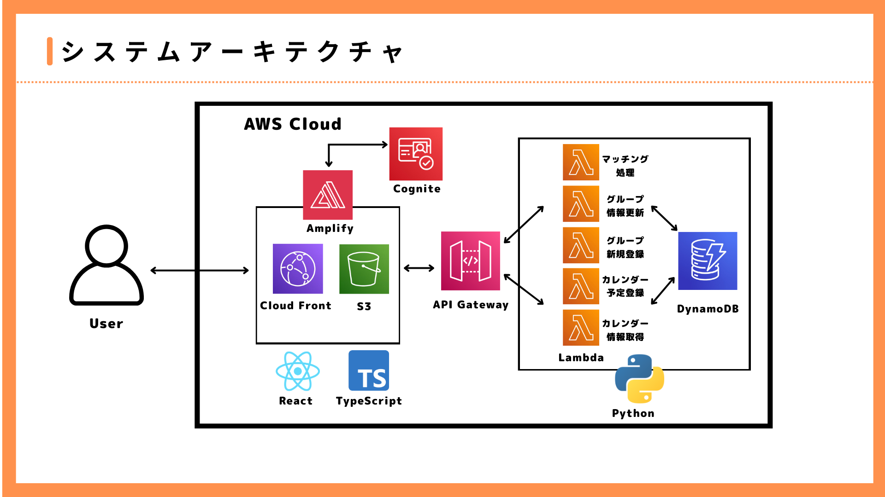

# Event Matching App

## 📋 プロジェクト概要
ユーザーがカレンダーから日付と希望のイベント内容を登録するだけで、システムが最適なグループを自動でマッチングし、イベントを提案する「おまかせ」ソーシャルマッチングアプリ。

## 🏗️ システム構成図


## 📱 画面設計

### 主要画面構成
1. **ホーム画面（カレンダー）** - `/dashboard`
   - カレンダー表示（月次表示）
   - 今日の日付・予定ありの日付表示
   - 月移動機能

2. **予定登録画面** - `/form`
   - 選択日付表示
   - アクティビティ選択（ボードゲーム、バレーボール、カラオケ、映画鑑賞）
   - 楽しみ方選択（エンジョイ、ガチ）
   - グループ人数設定
   - 最終合計人数選択

3. **アプリ提案画面** - `/proposal`
   - イベント詳細表示
   - 場所候補リスト（推奨・通常）
   - 参加・辞退ボタン

4. **マッチング中画面** - `/matching`
   - マッチング進行状況
   - 現在の参加者数表示
   - メンバー募集状況
   - 場所検索状況

### UI/UXデザイン仕様

#### カラーパレット
- **Primary**: #E53E3E (親しみやすい赤系)
- **Secondary**: #FED7D7 (ピンク背景)
- **Success**: #10B981 (グリーン)
- **Warning**: #F59E0B (オレンジ)
- **Background**: #FFFFFF (ホワイト)
- **Text**: #2D3748 (ダークグレー)

#### コンポーネントデザイン
- **カード型レイアウト**: 角丸、シャドウ付き
- **ボタン**: 角丸、適切なホバーエフェクト
- **フォーム要素**: 直感的な選択UI
- **アイコン**: 絵文字とFontAwesome併用

#### レスポンシブ対応
- **Mobile First**: 320px-414px (iPhone対応)
- **Tablet**: 768px-1024px
- **Desktop**: 1024px+

## 🛠️ 技術スタック

### フロントエンド
- **Framework**: React 19 + TypeScript
- **Styling**: Tailwind CSS
- **Routing**: React Router DOM
- **State Management**: React Query + Context API
- **Date Handling**: date-fns
- **Icons**: React Icons
- **HTTP Client**: Fetch API

### バックエンド (AWS)
- **API**: API Gateway + Lambda
- **Database**: RDS (PostgreSQL)
- **Storage**: S3
- **CDN**: CloudFront

## 🚀 セットアップ

### 前提条件
- Node.js 16.x 以上
- npm または yarn

### インストール手順
```bash
# リポジトリをクローン
git clone <repository-url>
cd event-matching

# 依存関係をインストール
npm install

# 開発サーバーを起動
npm start
```

### 環境変数
`.env.local` ファイルを作成し、以下の環境変数を設定してください：

```env
REACT_APP_API_BASE_URL=https://your-api-gateway-url
REACT_APP_AWS_REGION=ap-northeast-1
```

## 📱 主要機能

### ユーザーフロー
1. **カレンダー表示** - 日付選択
2. **イベント登録** - アクティビティ・詳細設定
3. **マッチング処理** - 自動グループ編成
4. **場所提案** - AIによる店舗推奨
5. **参加確定** - 最終確認・決定

### 機能詳細

#### カレンダー機能
- [ ] 月次カレンダー表示
- [ ] 日付選択機能
- [ ] 予定表示（今日・予定あり）
- [ ] 月移動（前月・次月）

#### イベント登録機能
- [ ] アクティビティ選択
  - ボードゲーム
  - バレーボール
  - カラオケ
  - 映画鑑賞
- [ ] 楽しみ方選択（エンジョイ・ガチ）
- [ ] グループ人数設定（+/-ボタン）
- [ ] 最終合計人数選択（4〜6人、8〜12人）

#### マッチング機能
- [ ] 自動グループ編成
- [ ] リアルタイム参加者数表示
- [ ] メンバー募集状況
- [ ] 場所候補検索・提案

#### 場所提案機能
- [ ] AI推奨場所表示
- [ ] 複数候補提示
- [ ] 住所・詳細情報表示
- [ ] 参加・辞退選択

## 📂 ディレクトリ構造

```
src/
├── components/          # 再利用可能なUIコンポーネント
│   ├── common/         # 汎用コンポーネント
│   │   ├── Button/
│   │   ├── Card/
│   │   ├── Header/
│   │   └── Layout/
│   ├── calendar/       # カレンダー関連
│   │   ├── Calendar/
│   │   ├── DatePicker/
│   │   └── MonthNavigator/
│   ├── event/          # イベント関連コンポーネント
│   │   ├── EventCard/
│   │   ├── EventForm/
│   │   ├── ActivitySelector/
│   │   ├── GroupSizeSelector/
│   │   └── IntensitySelector/
│   ├── matching/       # マッチング関連
│   │   ├── MatchingStatus/
│   │   ├── ParticipantCounter/
│   │   └── VenueCard/
│   └── venue/          # 場所関連
│       ├── VenueList/
│       ├── VenueCard/
│       └── VenueSearch/
├── pages/              # ページコンポーネント
│   ├── Dashboard/      # ホーム（カレンダー）
│   ├── EventForm/      # 予定登録
│   ├── Proposal/       # アプリ提案
│   ├── Matching/       # マッチング中
│   └── Profile/        # プロフィール
├── hooks/              # カスタムフック
│   ├── useCalendar.ts
│   ├── useEvents.ts
│   ├── useMatching.ts
│   └── useVenues.ts
├── services/           # API通信・外部サービス
│   ├── api/
│   │   ├── events.ts
│   │   ├── matching.ts
│   │   ├── venues.ts
│   │   └── client.ts
│   └── utils/
├── types/              # TypeScript型定義
│   ├── event.ts
│   ├── user.ts
│   ├── venue.ts
│   ├── matching.ts
│   └── calendar.ts
├── utils/              # ユーティリティ関数
│   ├── dateUtils.ts
│   ├── constants.ts
│   └── formatters.ts
└── styles/             # スタイル関連
    ├── globals.css
    └── components.css
```

## 🔌 API仕様

### Base URL
```
Production: https://api.event-matching.com
Development: http://localhost:3001
```

### エンドポイント

#### 1. イベント登録
```http
POST /api/events
Content-Type: application/json

{
  "userId": 1,
  "date": "2024-12-25",
  "activityType": "ボードゲーム",
  "intensity": "エンジョイ",
  "groupSize": 2,
  "totalCapacity": "4-6人"
}
```

#### 2. マッチング状況取得
```http
GET /api/matching/{eventId}
```

#### 3. 場所候補取得
```http
GET /api/venues/search?activity={activity}&location={location}&capacity={capacity}
```

## 🗄️ データ構造

### Event（イベント）
```typescript
interface Event {
  id: string;
  userId: string;
  date: string;
  activity: 'ボードゲーム' | 'バレーボール' | 'カラオケ' | '映画鑑賞';
  intensity: 'エンジョイ' | 'ガチ';
  groupSize: number;
  totalCapacity: '4-6人' | '8-12人';
  status: 'recruiting' | 'matched' | 'confirmed' | 'cancelled';
}
```

### Venue（場所）
```typescript
interface Venue {
  id: string;
  name: string;
  address: string;
  category: string;
  isRecommended: boolean;
  capacity: number;
  rating: number;
}
```

### Matching（マッチング）
```typescript
interface Matching {
  id: string;
  eventId: string;
  currentParticipants: number;
  minCapacity: number;
  maxCapacity: number;
  status: 'searching' | 'found' | 'confirmed';
  venues: Venue[];
}
```

## 🧪 テスト

```bash
# 単体テスト実行
npm test

# カバレッジレポート生成
npm run test:coverage

# E2Eテスト実行
npm run test:e2e
```

## 📦 ビルド・デプロイ

```bash
# プロダクションビルド
npm run build

# 静的ファイルサーバーで確認
npm run serve
```

## 📝 開発ロードマップ

### Phase 1: 基盤構築
- [x] プロジェクト初期化
- [x] 技術スタック選定
- [ ] ディレクトリ構造作成
- [ ] 共通コンポーネント実装

### Phase 2: コア機能開発
- [ ] カレンダーコンポーネント
- [ ] イベント登録フォーム
- [ ] マッチング画面
- [ ] 場所提案機能

### Phase 3: 仕上げ・最適化
- [ ] UI/UXブラッシュアップ
- [ ] パフォーマンス最適化
- [ ] テスト追加
- [ ] デプロイ準備

## 🤝 開発ルール

### コーディング規約
- ESLint + Prettier使用
- TypeScript strict mode
- コンポーネントはPascalCase
- ファイル名はkebab-case

### コミットメッセージ
```
feat: 新機能追加
fix: バグ修正
docs: ドキュメント更新
style: スタイル変更
refactor: リファクタリング
test: テスト追加・修正
```

## 📞 サポート・問い合わせ

開発に関する質問や問題がある場合は、以下までご連絡ください：

- **Email**: [your-email@domain.com]
- **Slack**: #event-matching-dev
- **Issue Tracker**: GitHub Issues
